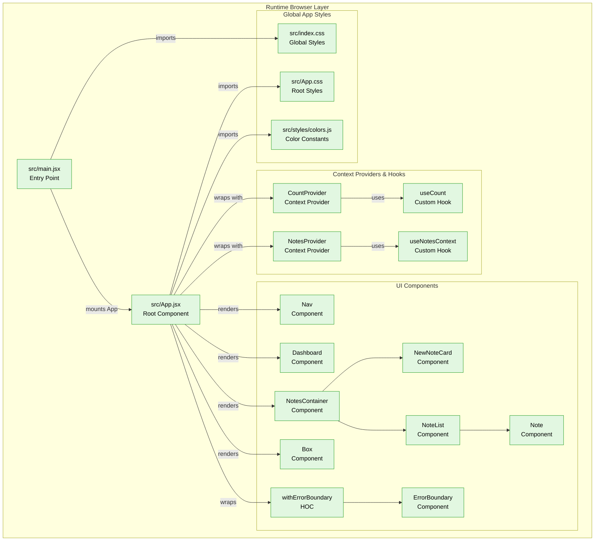

# React Demo Debug

This project is a demonstration of basic and elementary features and concepts of React. It serves as a learning tool and a starting point for building more complex React applications.

## Features

- **React:** The core library for building user interfaces.
- **React Router:** For handling client-side routing and navigation.
- **Styled Components:** For styling React components.
- **Vite:** A fast build tool for modern web development.
- **ESLint:** For identifying and reporting on patterns found in ECMAScript/JavaScript code.

## Project Structure



The project is structured as follows:

```
├── .gitignore
├── eslint.config.js
├── index.html
├── package-lock.json
├── package.json
├── README.md
├── vite.config.js
├── public
│   └── vite.svg
└── src
    ├── App.css
    ├── App.jsx
    ├── index.css
    ├── main.jsx
    ├── assets
    │   └── react.svg
    ├── components
    │   ├── Box
    │   ├── Dashboard
    │   ├── ErrorBoundary
    │   ├── Nav
    │   └── Notes
    ├── context
    │   ├── Counter
    │   └── Notes
    └── styles
        └── colors.js
```

### `src` Directory

- **`main.jsx`**: The entry point of the application. It renders the `App` component into the DOM.
- **`App.jsx`**: The main application component. It sets up the routing and context providers.
- **`components`**: Contains reusable UI components.
  - **`Box`**: A simple component that demonstrates basic state management.
  - **`Dashboard`**: The main dashboard of the application.
  - **`ErrorBoundary`**: A component that catches JavaScript errors anywhere in its child component tree.
  - **`Nav`**: The navigation bar of the application.
  - **`Notes`**: A component for creating and managing notes.
- **`context`**: Contains React context providers for managing global state.
  - **`Counter`**: A context for managing a simple counter.
  - **`Notes`**: A context for managing the notes.
- **`styles`**: Contains global styles and color definitions.

## Available Scripts

In the project directory, you can run:

### `npm run dev`

Runs the app in the development mode.
Open [http://localhost:3000](http://localhost:3000) to view it in the browser.

The page will reload if you make edits.
You will also see any lint errors in the console.

### `npm run build`

Builds the app for production to the `dist` folder.
It correctly bundles React in production mode and optimizes the build for the best performance.

The build is minified and the filenames include the hashes.
Your app is ready to be deployed!

### `npm run lint`

Lints the project files using ESLint.

### `npm run preview`

Serves the production build locally for previewing.

## Debugging

This project is configured with source maps to help with debugging. This means that you can set breakpoints and inspect the original source code in your browser's developer tools, even though the code is minified and bundled for production.
